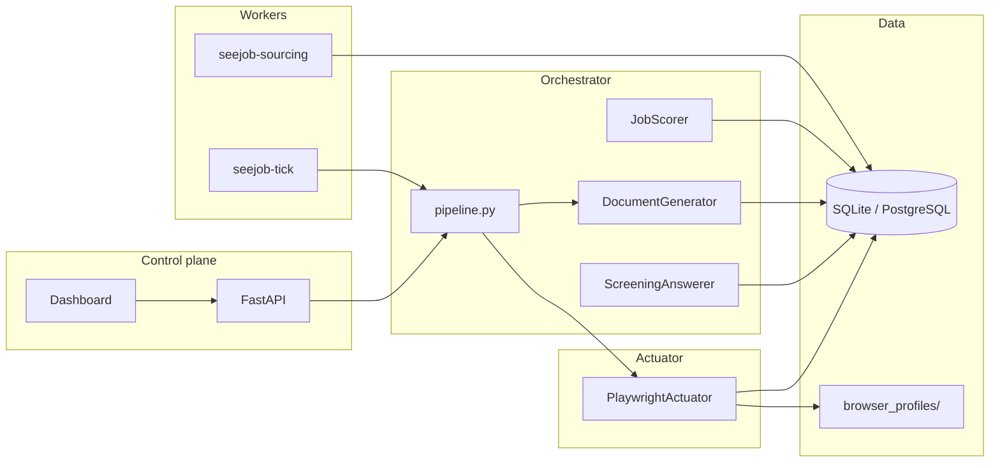
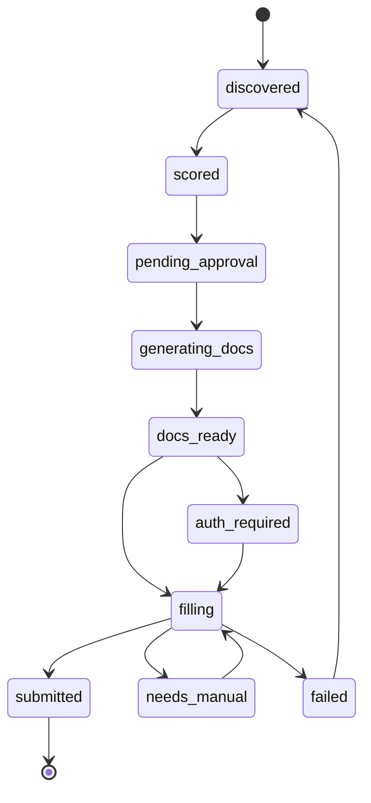

# SeeJob Architecture

Local-first autonomous job application system. Orchestration (planning, scoring, documents, policy) is separated from actuation (browser form fill). Human approval gates sit between document generation and submission.

## Layers

| Layer | Path | Role |
|-------|------|------|
| API | `seejob/api/` | FastAPI routes, CORS, serves `dashboard/dist` |
| Services | `seejob/services/` | Business logic — pipeline, state machine, policy, rate limits |
| Agents | `seejob/agents/` | LLM document generation, scoring, screening answers |
| Browser | `seejob/browser/` | Playwright actuator — fill, upload, submit |
| Workers | `seejob/workers/` | `seejob-sourcing`, `seejob-tick` (cron, not 24/7) |
| Integrations | `seejob/integrations/` | Gmail OTP, CapSolver captcha |
| Models | `seejob/models/` | SQLAlchemy ORM + Alembic migrations |
| Dashboard | `dashboard/` | React control UI (Vite, TanStack Query) |

**Rule:** never mix orchestration into browser code or browser logic into agents.

## Data flow

## Application lifecycle

Gates (unless `PolicyConfig.auto_apply`):
- **pending_approval** — human approves job targeting
- **docs_ready** — preview/approve generated CV and cover letter
- **submit** — human approves before `submit_form()`

Interrupts (`needs_manual`, `auth_required`) store JSON metadata; resume via `POST /api/v1/applications/{id}/resume`.

## Scheduler model

Workers are **single-tick CLIs** for cron/Task Scheduler — not always-on daemons.

| Command | Purpose |
|---------|---------|
| `seejob-sourcing` | Poll RSS/manual sources, ingest and score jobs |
| `seejob-tick` | Sourcing pass + approved pipeline queue (doc gen + apply) |

Rate limits enforced per platform per UTC day via `AgentRun` audit rows (`seejob/services/rate_limit.py`).

## Key services

| Module | Responsibility |
|--------|----------------|
| `state_machine.py` | Valid `ApplicationStatus` transitions only via `transition()` |
| `pipeline.py` | `run_pipeline_for_application` — docs then browser apply |
| `apply.py` | Browser apply with approval and interrupt handling |
| `documents.py` | Queue/generate PDFs with truthfulness guard |
| `auth.py` | Site credential lookup, login hooks, session sync |
| `qa.py` / `screening.py` | Q&A bank cache (`question_hash`) |
| `events.py` | SSE event stream for dashboard |

## Production deploy

`docker-compose.yml` runs API + PostgreSQL. API image includes Playwright Chromium and serves the built dashboard at `/`. Optional Chroma profile for vector search.

## Security defaults

- Fernet-encrypted `SiteAccount` credentials and session cookies
- `TruthfulnessConstraint.allow_inference=False` by default
- `require_doc_approval` and `require_submit_approval` enabled in default policy
